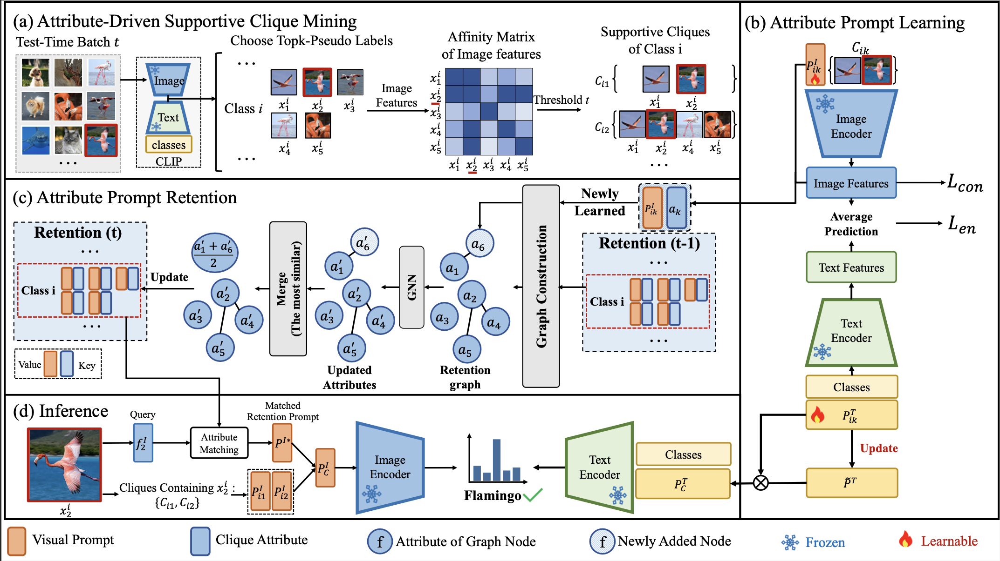
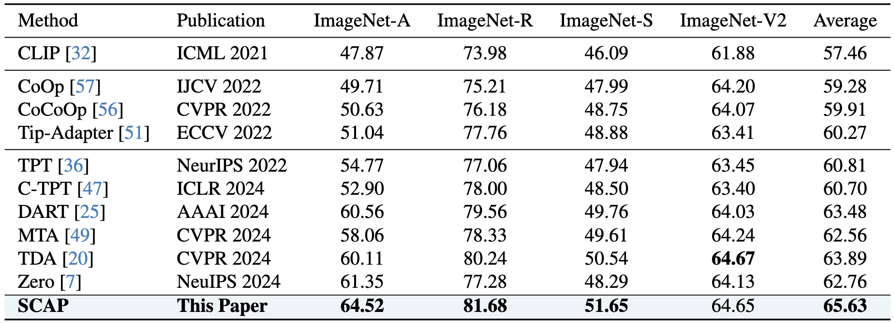

# [CVPR2025] SCAP: Transductive Test-Time Adaptation via Supportive Clique-based Attribute Prompting

<div align="center">

<div>
      Chenyu Zhang<sup>#</sup>&emsp; Kunlun Xu<sup>#</sup>&emsp; Zichen Liu&emsp; Yuxin Peng&emsp; Jiahuan Zhou<sup>*</sup>
  </div>
<div>

  <sup></sup>Wangxuan Institute of Computer Technology, Peking University&emsp;

</div>
</div>
<p align="center">
  <a href='https://arxiv.org/abs/2503.12866'></a>
  <a href="https://hits.seeyoufarm.com"></a>
</p>

The *official* repository for  [SCAP: Transductive Test-Time Adaptation via Supportive Clique-based Attribute Prompting](https://arxiv.org/abs/2503.12866).





### Environment Preparation
```shell
conda create -n TTA python=3.11
conda activate TTA
pip install torch==2.4.0 torchvision==0.19.0 torchaudio==2.4.0 --index-url https://download.pytorch.org/whl/cu118
pip install -r requirement.txt
```

### Data
You should download [ImageNet-A](https://github.com/hendrycks/natural-adv-examples), [ImageNet-R](https://github.com/hendrycks/imagenet-r), [ImageNet-Sketch](https://github.com/HaohanWang/ImageNet-Sketch) and [ImageNet-V](https://github.com/modestyachts/ImageNetV2) first.


Then your data directory should be organized in the following format:

- **you_data_path**
  - *imagenet-a*
  - *imagenet-r*
  - *imagenet-sketch*
  - *imagenet-v2-matched-frequency-format-val*


### Evaluation
You can run the following commands for ImageNet-A/R/Sketch/V2 respectively:
```
bash scripts/A.sh
```
```
bash scripts/R.sh
```
```
bash scripts/K.sh
```
```
bash scripts/V.sh
```

### Results
The results were obtained with a single NVIDIA 4090 GPU.

The Acc@1 comparison results against CLIP, few-shot learning methods and the latest test-time adaptation methods on 4 benchmark datasets.




### Citation
If you find this code useful for your research, please cite our paper.
```
@article{zhang2025scap,
  title={SCAP: Transductive Test-Time Adaptation via Supportive Clique-based Attribute Prompting},
  author={Zhang, Chenyu and Xu, Kunlun and Liu, Zichen and Peng, Yuxin and Zhou, Jiahuan},
  journal={arXiv preprint arXiv:2503.12866},
  year={2025}
}
```


### Acknowledgement
Our code is based on the PyTorch implementation of [TPT](https://github.com/azshue/TPT) and  [DART](https://github.com/zhoujiahuan1991/AAAI2024-DART).

### Contact
For any questions, feel free to contact us ([xkl@stu.pku.edu.cn](xkl@stu.pku.edu.cn)).

Welcome to our Laboratory Homepage ([OV<sup>3</sup> Lab](https://zhoujiahuan1991.github.io/)) for more information about our papers, source codes, and datasets.
